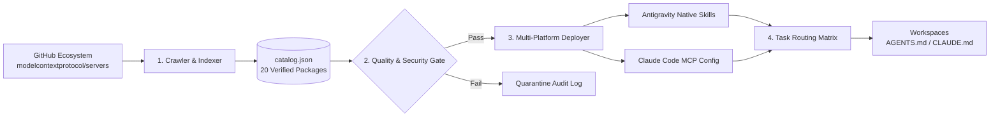

# ⚡ AI Skills & Model Context Protocol (MCP) Registry

<div align="center">

**Automated Discovery, Quality Validation, and Multi-Platform Deployment Engine for AI Agents**

[](LICENSE)
[](https://python.org)
[](http://json-schema.org/draft-07/schema#)
[](#-catalog-inventory)
[](#-multi-platform-deployment--host-safety)
[](#-testing--verification)

<p align="center">
  <a href="#-overview">Overview</a> •
  <a href="#-architecture">Architecture</a> •
  <a href="#-quick-start">Quick Start</a> •
  <a href="#-catalog-inventory">Catalog</a> •
  <a href="#-multi-platform-deployment--host-safety">Safety & Deployment</a> •
  <a href="#-intelligent-task-routing">Task Routing</a> •
  <a href="#-testing--verification">Tests</a>
</p>

---

</div>

## 🌟 Overview

The **AI Skills & MCP Registry** provides an enterprise-grade pipeline that bridges open-source GitHub skills and MCP servers with local AI developer environments—including **Google Antigravity**, **Claude Code**, and **Cursor / Codex**.

It solves tool discovery fragmentation, schema incompatibility, and context window bloat by enforcing automated security gating, non-destructive atomic configuration management, and progressive task-based intent routing.

### 🎯 Key Capabilities

- 🛡️ **Non-Destructive Deep Merge**: Safely merges new servers into `~/.claude.json` and Antigravity configs with zero risk to pre-existing API keys or credentials.
- 🔒 **Four-Tier Security Gate**: Blocks CVE vulnerabilities, unmaintained packages, directory traversal attacks, and command injection before code touches your machine.
- ⚡ **Zero Context Saturation**: Dynamic 2-tier task routing keeps workspace prompt rules well under 100 lines and strict 24 KB / 20k token budgets.
- 🧪 **Deterministic Sandbox Testing**: Dry-run runner executes sandboxed tool calls and validates JSON-RPC schema compliance with zero unhandled exceptions.

---

## 🏗️ Architecture



### 5-Stage Pipeline

| Stage | Subsystem | Responsibility |
|---|---|---|
| **1. Discovery** | `src/crawler` | Queries registries, parses repository metadata, stars, license, and tool manifests |
| **2. Validation** | `src/validator` | Applies security filters, Draft-07 JSON-RPC schema checks, and YAML frontmatter validation |
| **3. Dry-Run** | `src/validator` | Sandboxed execution harness verifying command invocation and error recovery |
| **4. Deployment** | `src/deployer` | Non-destructive atomic deep-merging to Antigravity (`~/.gemini`) and Claude (`~/.claude.json`) |
| **5. Routing** | `src/router` | Injects progressive task-based routing tables with preserved user policies |

---

## 🚀 Quick Start

### Prerequisites
- **Python**: `3.10+`
- **Node.js**: `18+` (for `npx`-based MCP servers)
- **Git**

### Installation

```bash
git clone https://github.com/IamAzmathullaShaikh/AI-Skills-Registry.git
cd AI-Skills-Registry
python -m venv .venv
# Windows:
.venv\Scripts\activate
# Linux/macOS:
source .venv/bin/activate
pip install -r requirements.txt # or pytest jsonschema pyyaml
```

### One-Command Pipeline Run

Execute the complete end-to-end sync, validation, deployment preview, and routing pipeline:

```bash
python -m src.pipeline --dry-run
```

### Individual Subsystems

```bash
# 1. Run offline catalog crawl
python -m src.crawler.github_crawler --offline --output catalog.json

# 2. Run security and schema validation
python -m src.validator.dry_run_runner --catalog catalog.json

# 3. Preview Antigravity deployment
python -m src.deployer.antigravity_deployer --dry-run

# 4. Preview Claude Code configuration merge
python -m src.deployer.claude_deployer --dry-run

# 5. Inject managed routing delimiters
python -m src.router.rule_injector --dry-run
```

---

## 📦 Catalog Inventory

The registry indexes **20 verified, production-grade packages** categorized across 5 domains:

<details open>
<summary><b>🌐 Browser & Web Search (4 tools)</b></summary>
<br/>

| Package ID | Name | Type | Stars | License | Purpose |
|---|---|---|---|---|---|
| `browser-playwright` | **Playwright Automation** | `mcp_server` | 36k ⭐ | Apache-2.0 | Headless browser execution, DOM inspection, screenshots |
| `browser-puppeteer` | **Puppeteer Server** | `mcp_server` | 32k ⭐ | MIT | Chrome DevTools Protocol web scraping and interaction |
| `brave-search` | **Brave Search MCP** | `mcp_server` | 32k ⭐ | MIT | Real-time global web search and news indexing |
| `fetch-markdown` | **Fetch to Markdown** | `mcp_server` | 32k ⭐ | MIT | Fast web content fetching to clean markdown |

</details>

<details open>
<summary><b>💻 Code Intelligence & VCS (4 tools)</b></summary>
<br/>

| Package ID | Name | Type | Stars | License | Purpose |
|---|---|---|---|---|---|
| `github-inspector` | **GitHub Context Server** | `mcp_server` | 32k ⭐ | MIT | Issues, Pull Requests, repos, commits, and workflows |
| `git-repo-tools` | **Git Operations Server** | `mcp_server` | 32k ⭐ | MIT | Local Git inspection, branch diffs, commit history |
| `pyright-lsp` | **Pyright Language Server** | `mcp_server` | 14k ⭐ | MIT | Python type checking, symbols, and diagnostics |
| `rust-analyzer-mcp` | **Rust Analyzer MCP** | `mcp_server` | 16k ⭐ | Apache-2.0 | Cargo diagnostics, Rust AST, macro expansions |

</details>

<details>
<summary><b>🗄️ Data & Databases (4 tools)</b></summary>
<br/>

| Package ID | Name | Type | Stars | License | Purpose |
|---|---|---|---|---|---|
| `sqlite-inspector` | **SQLite Database Explorer** | `mcp_server` | 32k ⭐ | MIT | Query SQLite tables, schema inspection, query plans |
| `postgres-connector` | **PostgreSQL Server** | `mcp_server` | 32k ⭐ | MIT | Parameterized SQL execution and schema introspection |
| `duckdb-analyzer` | **DuckDB Analytics** | `mcp_server` | 1.2k ⭐ | MIT | Embedded columnar querying over Parquet and CSVs |
| `redis-manager` | **Redis K/V Manager** | `mcp_server` | 850 ⭐ | BSD-3 | Key inspection, memory tracking, and hash query |

</details>

<details>
<summary><b>⚙️ System & Cloud Operations (4 tools)</b></summary>
<br/>

| Package ID | Name | Type | Stars | License | Purpose |
|---|---|---|---|---|---|
| `docker-container-mcp`| **Docker Engine Inspector** | `mcp_server` | 2.4k ⭐ | Apache-2.0 | Container status, logs, image layers, network inspection |
| `filesystem-mcp` | **Secure Filesystem MCP** | `mcp_server` | 32k ⭐ | MIT | Scoped file operations with directory tree listings |
| `terminal-executor` | **Safe Command Runner** | `mcp_server` | 1.5k ⭐ | MIT | Whitelisted terminal processes with timeout caps |
| `kubernetes-mcp` | **Kubernetes Inspector** | `mcp_server` | 920 ⭐ | Apache-2.0 | Pod logs, cluster state, and deployment diagnostics |

</details>

<details>
<summary><b>🎬 Media & Creative (4 tools)</b></summary>
<br/>

| Package ID | Name | Type | Stars | License | Purpose |
|---|---|---|---|---|---|
| `opencut` | **OpenCut Video Editor** | `skill` | 4.5k ⭐ | MIT | Web video editing, timeline assembly, media export |
| `ffmpeg-media-tools` | **FFmpeg Converter** | `mcp_server` | 1.1k ⭐ | LGPL-2.1 | Transcoding, stream probing, audio clipping |
| `image-processor` | **Image Manipulation** | `mcp_server` | 750 ⭐ | MIT | Crop, resize, color space conversion, EXIF extraction |
| `audio-transcriber` | **Speech Transcriber** | `mcp_server` | 1.8k ⭐ | MIT | Local speech-to-text audio transcription |

</details>

---

## 🛡️ Multi-Platform Deployment & Host Safety

The deployment engine adheres to strict isolation and non-destructive host safety invariants:

```
~/.claude.json  ───────►  [ Temporary Staging .tmp.<pid> ]
                                 │
                                 ▼ (Atomic os.replace)
~/.claude.json  ◄───────  [ Deep-Merged Configuration ]
                                 │
                                 └─► Auto Backup to ~/.ai-skills-registry/backups/
```

### Safety Invariants

> [!IMPORTANT]
> **Zero Host Degradation Guarantee**: Existing user configurations—including pre-existing API keys, custom MCP servers (e.g. `tinyfish`), and environment tokens—are strictly preserved during deep merge operations.

- **Google Antigravity**:
  - Native skills mounted to `~/.gemini/config/skills/<name>/SKILL.md` with standard YAML frontmatter.
  - MCP servers configured via `~/.gemini/config/mcp_config.json`.
- **Claude Code**:
  - Writes to staging file `~/.claude.json.tmp.<pid>`, verifies JSON validity, and executes an atomic swap (`os.replace`).
  - Automatic timestamped backups saved before every write.
- **Rule Delimiter Encapsulation**:
  - Injected routing matrix lives exclusively within managed comments:
    ```markdown
    <!-- BEGIN AI-SKILLS-REGISTRY MANAGED ROUTING -->
    ... managed directives ...
    <!-- END AI-SKILLS-REGISTRY MANAGED ROUTING -->
    ```
  - Preserves external directives (such as AWS Agent Toolkit single-region rules and Crave cloud compilation policies).
  - Strictly respects the **24 KB / 20k token** budget.

---

## 🧭 Intelligent Task Routing

The registry generates a 2-Tier Progressive Task-Based Intent Matrix (<100 lines) mapping user prompts directly to verified tools without context saturation:

| Intent Category | Triggers & Keywords | Primary Tool | Platform |
|---|---|---|---|
| **Web Browsing** | `browse`, `scrape`, `screenshot`, `dom` | `browser-playwright`, `browser-puppeteer` | Antigravity, Claude Code |
| **Live Research** | `search online`, `find docs`, `web query` | `brave-search`, `fetch-markdown` | Antigravity, Claude Code |
| **Git & PR Work** | `pull request`, `git diff`, `commit log` | `github-inspector`, `git-repo-tools` | Antigravity, Claude Code |
| **Type Check & LSP**| `typecheck`, `symbol search`, `python lsp` | `pyright-lsp`, `rust-analyzer-mcp` | Claude Code |
| **Databases** | `sql`, `query postgres`, `sqlite schema` | `sqlite-inspector`, `postgres-connector` | Antigravity, Claude Code |
| **Analytics & OLAP**| `parquet`, `columnar`, `duckdb`, `csv` | `duckdb-analyzer` | Antigravity, Claude Code |
| **Cache & Memory** | `redis`, `cache keys`, `ttl` | `redis-manager` | Antigravity, Claude Code |
| **Containers & K8s**| `docker ps`, `container logs`, `k8s pod` | `docker-container-mcp`, `kubernetes-mcp` | Antigravity, Claude Code |
| **Video Production**| `edit video`, `timeline`, `cut clip` | `opencut` (Skill), `ffmpeg-media-tools` | Antigravity, Claude Code |
| **Audio & Images** | `transcribe speech`, `resize image` | `audio-transcriber`, `image-processor` | Antigravity, Claude Code |

---

## 🧪 Testing & Verification

The repository contains an exhaustive 5-tier test suite covering 43 test suites:

```
tests/
├── conftest.py                           # Parameterized sandbox fixtures
├── tier1_feature_coverage/               # Core functional verification (F1-F13)
├── tier2_boundary_corner/                # Edge cases, network drops, malformed JSON
├── tier3_cross_feature/                  # Integration pairs across pipeline phases
├── tier4_real_world/                     # Non-destructive host deployment scenarios
└── adversarial/                          # Stress harness and mutation resistance
```

### Running the Test Suite

```bash
# Run all tests
python tests/run_all_tests.py

# Run specific tier with pytest
python -m pytest tests/tier1_feature_coverage/ -v
python -m pytest tests/tier4_real_world/ -v
```

---

## 🤝 Contributing

Contributions are welcome! Please ensure that:
1. All new MCP server submissions include valid JSON-RPC schema metadata.
2. Skills conform to the standard `SKILL.md` frontmatter specification (`name`, `description`).
3. Added packages pass all security gating and test tiers (`python tests/run_all_tests.py`).

---

## 📄 License

This repository is licensed under the [MIT License](LICENSE).
Individual catalog tools and MCP servers are distributed under their respective open-source licenses as documented in [`catalog.json`](catalog.json).
